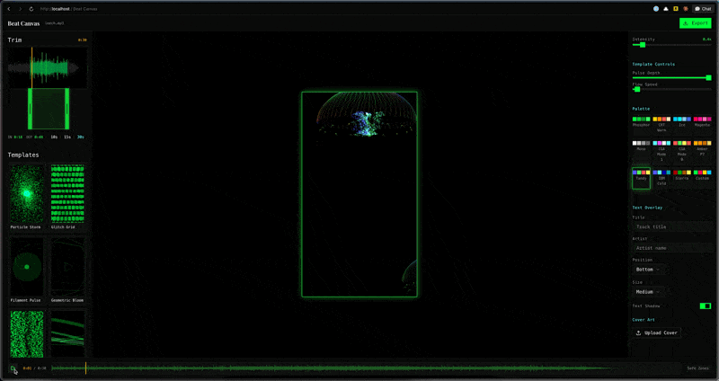

# Beat Canvas

Audio-reactive vertical video clip creator. Upload a song, trim a segment, pick a visual template, and export a 9:16 video — all client-side in the browser. No server, no uploads, no accounts.

Built with Next.js 16, Three.js, Web Audio API, and ffmpeg.wasm.




## Features

- **Audio analysis** — Custom Cooley-Tukey FFT extracts bass, mid, treble, and amplitude at 30 FPS with attack/release smoothing
- **19 visual templates** — GLSL shaders and particle systems spanning psychedelic, organic, geometric, and glitch styles
- **Real-time preview** — Three.js renders the selected template driven by reactive audio data
- **Trim control** — Draggable waveform handles to select up to 30 seconds of audio
- **12 color palettes** — Phosphor green, CRT warm, ice, magenta burn, amber, CGA modes, and more
- **Text & cover art overlays** — Position, scale, and style title/artist text and album artwork
- **Client-side export** — MediaRecorder captures frames, ffmpeg.wasm muxes audio + video into MP4/WebM
- **No backend** — Everything runs in-browser using SharedArrayBuffer for ffmpeg threading

## Getting Started

```bash
pnpm install
pnpm dev
```

Open [http://localhost:3000](http://localhost:3000). The app requires a browser with SharedArrayBuffer support (Chrome, Edge, Firefox).

### Requirements

- Node.js 18+
- pnpm (or npm/yarn)
- A modern browser with WebGL2 and SharedArrayBuffer

## How It Works

```
Upload audio → FFT analysis → Trim selection → Template + palette → Preview → Export
```

1. **Upload** (`/`) — Drop an audio file. The Web Audio API decodes it and generates a waveform overview.
2. **Editor** (`/editor`) — The workspace where everything comes together:
   - **Trim** the audio to a clip (max 30s) using draggable handles over the waveform
   - **Browse templates** from the gallery with live-generated thumbnails
   - **Adjust controls** — each template exposes sliders/toggles (complexity, speed, symmetry, etc.)
   - **Pick a palette** and intensity multiplier
   - **Add overlays** — title, artist, cover art with positioning
   - **Preview** in real-time with synced audio playback
3. **Export** — Renders every frame offscreen at the chosen resolution, records via MediaRecorder, then muxes with the audio segment using ffmpeg.wasm.

## Templates

Each template implements the `TemplateModule` interface — `init()`, `update()`, `dispose()`, and `getControlsSchema()`. Templates receive a `ReactiveInput` containing the current audio frame (bass/mid/treble/amplitude), palette colors, intensity multiplier, and user-controlled parameters.

| Template | Style | Technique |
|---|---|---|
| Particle Storm | energy, particles | Point cloud with velocity fields |
| Glitch Grid | digital, glitch | Grid cells with displacement |
| Filament Pulse | organic, glow | Luminous filament strands |
| Geometric Bloom | geometric, minimal | Expanding geometric shapes |
| Pixel Sort Wave | glitch, wave | Pixel-sorting simulation |
| Neon Rings | neon, retro | Concentric ring oscillation |
| Star Field | space, particles | Parallax star flight |
| Waveform Terrain | terrain, data | 3D terrain from audio data |
| Kaleidoscope Vortex | psychedelic | Domain-warped FBM with kaleidoscopic folds + feedback |
| Liquid Chrome | organic, psychedelic | Ray-marched metaballs with iridescence |
| Sacred Geometry | geometric, spiritual | Animated sacred geometry patterns |
| Aurora Cascade | atmospheric | Layered FBM aurora curtains with stars |
| Fractal Tunnel | hypnotic | Ray-marched infinite tunnel with fractal walls |
| Plasma Morph | psychedelic | Triple domain-warped plasma with feedback |
| DNA Helix | organic, particles | Double helix particle system |
| Cosmic Jellyfish | bioluminescent | 3 jellyfish with bell, tentacles, and inner glow |
| Mirror Shatter | geometric, glitch | Voronoi fractured mirror shards |
| Smoke Ribbons | organic, ethereal | 8 flowing particle ribbon trails with feedback |
| Electric Mandala | psychedelic, mandala | Multi-layer mandala with 3-16 fold symmetry + feedback |

### Adding a Template

Create `src/templates/<name>/index.ts` implementing `TemplateModule`:

```typescript
import type { TemplateModule, RenderContext, ReactiveInput, TemplateControl } from "@/types/template";

class MyTemplate implements TemplateModule {
  id = "my-template";
  name = "My Template";
  tags = ["custom"];

  init(ctx: RenderContext) {
    // Set up Three.js objects, add to ctx.scene
  }

  update(ctx: RenderContext, input: ReactiveInput, delta: number) {
    // input.frame.bass, .mid, .treble, .amplitude (0-1)
    // input.palette — array of hex color strings
    // input.params — user-controlled values from getControlsSchema()
    // delta — seconds since last frame
  }

  dispose() {
    // Clean up geometries, materials, render targets
  }

  getControlsSchema(): TemplateControl[] {
    return [
      { id: "speed", label: "Speed", type: "slider", default: 0.5, min: 0, max: 1, step: 0.01 },
    ];
  }
}

export default new MyTemplate();
```

Register it in `src/templates/registry.ts`.

Templates that manage their own rendering (multi-pass feedback shaders) should set `ctx.scene.visible = false` at the end of `update()` to prevent the default render pass from clearing their output.

## Audio Pipeline

The `ReactiveFeatureBuilder` performs FFT analysis on the trimmed audio segment:

- **FFT size:** 2048 bins
- **Frame rate:** 30 FPS
- **Window:** Hanning
- **Bands:** Bass (20-250 Hz), Mid (250-4000 Hz), Treble (4000-16 kHz)
- **Smoothing:** Attack alpha 0.8, release alpha 0.3
- **Normalization:** Per-band max normalization with quiet-audio boost

Output is a `ReactiveFrame[]` array where each value is normalized 0-1.

## Export Pipeline

Export runs entirely client-side in three stages:

1. **Prepare** — Creates an offscreen Three.js renderer + canvas at the target resolution
2. **Render** — Steps through every frame at 30 FPS, calling `template.update()` + `renderer.renderFrame()` and recording via `MediaRecorder`
3. **Transcode** — ffmpeg.wasm muxes the recorded video blob with the extracted audio segment into MP4 or WebM

ffmpeg.wasm requires `SharedArrayBuffer`, enabled via COOP/COEP headers in `next.config.ts`.

## Project Structure

```
src/
├── app/                    # Next.js routes (/, /editor)
├── components/
│   ├── editor/             # Editor workspace components
│   ├── segment/            # Waveform + trim handles
│   ├── ui/                 # shadcn/ui primitives
│   └── upload/             # Upload page components
├── hooks/                  # useAnimationLoop, useAudioPlayback, useExport, etc.
├── lib/
│   ├── audio/              # FFT analysis, waveform builder, audio loader
│   ├── export/             # Export orchestration, canvas recorder, ffmpeg transcoder
│   ├── render/             # Three.js renderer, template manager, palettes, overlays
│   └── state/              # Zustand store
├── templates/              # 19 visual templates (each in own directory)
│   └── registry.ts         # Template registration
└── types/                  # TypeScript interfaces
```

## Tech Stack

| Layer | Technology |
|---|---|
| Framework | Next.js 16, React 19 |
| 3D rendering | Three.js 0.182 |
| State | Zustand 5 |
| Audio | Web Audio API, custom FFT |
| Video export | MediaRecorder + ffmpeg.wasm 0.12 |
| UI components | shadcn/ui (Radix), Tailwind CSS 4 |
| Animations | Framer Motion |
| Fonts | Playfair Display (headings), IBM Plex Mono (body) |
| Theme | Dark, retro-digital palette |

## Configuration

### Quality Tiers

| Tier | Pixel Ratio | Particle Multiplier | Post-Processing |
|---|---|---|---|
| Low | 1x | 0.5x | Off |
| Medium | 1.5x | 1x | On |
| High | 2x | 1.5x | On |

### Color Palettes

`phosphor` (neon green), `crt_warm` (gold/orange), `ice` (cyan/blue), `magenta_burn` (hot pink), `monochrome` (greys), `amber` (retro amber), `cga_mode0` (red/green/yellow), `cga_mode1` (cyan/magenta/white), `tandy` (rainbow), `ibm_cold` (blue/cyan), `sierra` (earthy CGA), `custom` (mixed)

## Development

```bash
pnpm dev          # Start dev server
pnpm build        # Production build
pnpm lint         # ESLint
```

### Key Technical Notes

- **COOP/COEP headers** are required for SharedArrayBuffer (ffmpeg.wasm). These are configured in `next.config.ts` and apply to all routes.
- **`noUncheckedIndexedAccess: true`** in tsconfig — array access returns `T | undefined`, so you must handle the undefined case.
- **Template singletons** — Templates are exported as singleton instances. The thumbnail generator creates fresh instances via the constructor to avoid polluting the editor's live instance.
- **Feedback templates** use their own `THREE.Scene` and render targets for multi-pass effects, then set `ctx.scene.visible = false` so the main renderer skips its default pass.

## License

Private.
